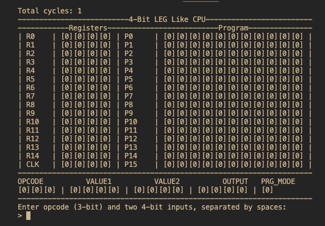

# README! 

## GENERAL STATEMENT:
- this code is a very simple simulation it is not an exact emulation and should not be treated as such.
- please try to understand the code, this helps with using the cpu (and may have the added benefit of a slightly deeper, albeit simplified, understanding of the general functions of a cpu)

## GENERAL COMMANDS:
- `reset`: resets all registers, program memory, clock, and inputs to 0.
- `exit` or (ctrl+c): quits the simulation (please note nothing will be preserved)
- `program`: captures all user input and puts it into program memory until either the cpu runs out of memory or the user types `end`
    - `end`: stops programming early
- `run`: resets the clock and runs the program currently in memory
    - NOTE: only way to quit once `run` is executed is (ctrl+c)

## ALU:
- the rusults of all ALU operations (`and`, `or`, `sub`, `add`) are stored in reg0, `not` is by default stored in reg0 but a destination can be specified

## OPCODES:
0. = ADD
    - Usage: 
      Add value in reg1 and reg2 (result will be stored in reg0)
      |opcode:| address1:|   address2:|
      |--------|---------|--------|
      |000|     0001        |0010|
1. = SUB
    - Usage: 
      Subtract value in reg2 from reg1 (result will be stored in reg0)
      |opcode:| address1:|   address2:|
      |--------|---------|--------|
      |001     |0001        |0010|
2. = MOV
    - Usage: 
      Move value in reg1 to reg2
      |opcode:| address1:|   address2:|
      |--------|---------|--------|
      |010     |0001        |0010|
3. = IMMD
    - Usage: 
      Insert value of 3 into reg4
      |opcode:| address1:|   value:|
      |--------|---------|--------|
      |011     |0100|        0011|
4. = JMP_IF_ZERO
    - Usage: 
      Jump to address 5 in program memory if reg0 is equal to zero
      |opcode:| address1:|   address2:|
      |--------|---------|--------|
      |100     |0000 |0101|
5. = AND
    - Usage: 
      And value in reg14 and reg2 (result will be stored in reg0)
      |opcode: |address1:   |address2:|
      |--------|---------|--------|
      |101     |1110|        0010|
6. = OR
    - Usage: 
      Add value in reg5 and reg4 (result will be stored in reg0)
      |opcode:|address1:|address2:|
      |--------|---------|--------|
      |110|0101|0100|
7. = NOT
    - Usage: 
      Not the value in reg1 and store it in reg2
      | opcode:| address1:|   address2:|
      |--------|---------|--------|
      |111|0001|0010
### NOTE: all of these have to be in binary (0000-1111) not decimal for input.

#### Example of UI:

### input format:
| OPCODE | Value1 | Value2 |
|----------|----------|----------|
| 000 to 111 | 0000 to 1111 | 0000 to 1111 |

#### Example:
inserting the number 5 into register 1:

| IMMD | R1 | 5  |
|------|----|----|
| 011  |0001|0101|

## How To Run:
To run this software you must first select the version. This repo includes two distinct versions of the code; one in python, and one in C.
- Which should you choose?
    - Python: 
        1. source code is easier to understand
        2. requires [python 3.11](https://www.python.org/downloads/) or greater runtime
    - C:
        1. technically quicker (doesn't matter since the simulation is capped at 5hz)
        2. requires [`gcc`](https://gcc.gnu.org), [`clang`](https://clang.llvm.org), or `cc` to compile
        3. this version may contain some bugs as it is still in development (Probably all good though)

#### Running The Python Version:
1. ensure you have the [python interpreter version 3.11 or newer](https://www.python.org/downloads/)
2. download the source code into your prefered directory
3. navigate to the directory in which you downloaded `4-bit_cpu_sim.py`
4. type `python3 4-bit_cpu_sim.py` and press enter (the simulation should now run)
#### Running The C Version:
1. ensure your system has a C compiler ([`gcc`](https://gcc.gnu.org), [`clang`](https://clang.llvm.org), or `cc`)
2. download the source code into your prefered directory
3. navigate to the directory in which you downloaded `4-bit_cpu_sim.c`
4. compile the program with `gcc -o cpu_simulation 4-bit_cpu_sim.c`
5. run the program by typing in the current directory `./cpu_simulation`
#### Note that this is only tested on "UNIX-like" operating systems. In other words I can't gauruntee it will work flawlessly on Windows.

---
## License
This project is licensed under the GNU General Public License v3.0 (GPL-3.0).  

Copyright (c) 2025 jonahmer22  

This program is free software: you can redistribute it and/or modify it under the terms of the GNU General Public License as published by the Free Software Foundation, either version 3 of the License, or (at your option) any later version.  

This program is distributed in the hope that it will be useful, but WITHOUT ANY WARRANTY; without even the implied warranty of MERCHANTABILITY or FITNESS FOR A PARTICULAR PURPOSE. See the GNU General Public License for more details.  

You should have received a copy of the GNU General Public License along with this program. If not, see [https://www.gnu.org/licenses/](https://www.gnu.org/licenses/).